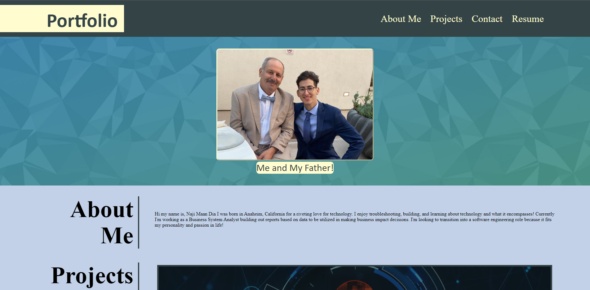
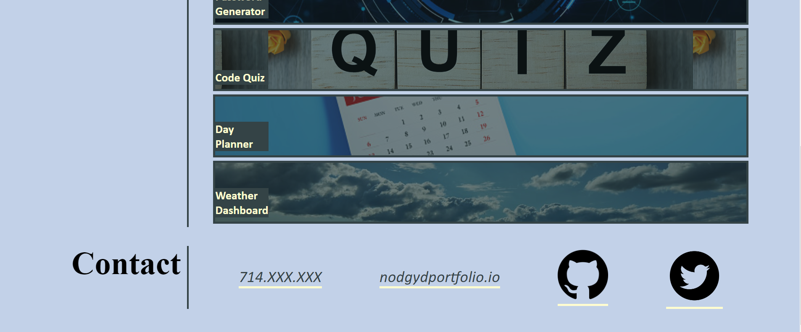

# <Your-Project-Title>

## Description
- The motivation behind this project was to deepen my knowledge in html semantics and advanced CSS!
- Built this project as a launch for when I apply for jobs to prove my work/skills!
- What problem does it solve? I solved a lot of problems when learning how to utilize flexboxes and media queries.
- I learned a lot about the interaction with flexboxes and how to setup a page based on where you want to put specific items within a container. 

## Table of Contents (Optional)
If your README is long, add a table of contents to make it easy for users to find what they need.
- [Installation](#installation)
- [Project-URL](#Project-URL)
- [Projects-Screenshots](#Project-Screenshots)
- [License](#license)

## Installation
Create a new repository on your GitHub account and clone it to your computer.

When you're ready to deploy, use the git add, git commit, and git push commands to save and push your code to your GitHub repository.

Navigate to your GitHub repository in the browser and then select the Settings tab on the right side of the page.
  
## Project URL
https://nodgyd.github.io/HW2-My-Portfolio/

## Project Screenshots
   
![[project screenshot 2]](./Assets/Images/ProjectScreenshots/screenshot2.jpg)

## License
MIT License

Copyright (c) [2021] [Naji Maan Dia]

Permission is hereby granted, free of charge, to any person obtaining a copy
of this software and associated documentation files (the "Software"), to deal
in the Software without restriction, including without limitation the rights
to use, copy, modify, merge, publish, distribute, sublicense, and/or sell
copies of the Software, and to permit persons to whom the Software is
furnished to do so, subject to the following conditions:

The above copyright notice and this permission notice shall be included in all
copies or substantial portions of the Software.

THE SOFTWARE IS PROVIDED "AS IS", WITHOUT WARRANTY OF ANY KIND, EXPRESS OR
IMPLIED, INCLUDING BUT NOT LIMITED TO THE WARRANTIES OF MERCHANTABILITY,
FITNESS FOR A PARTICULAR PURPOSE AND NONINFRINGEMENT. IN NO EVENT SHALL THE
AUTHORS OR COPYRIGHT HOLDERS BE LIABLE FOR ANY CLAIM, DAMAGES OR OTHER
LIABILITY, WHETHER IN AN ACTION OF CONTRACT, TORT OR OTHERWISE, ARISING FROM,
OUT OF OR IN CONNECTION WITH THE SOFTWARE OR THE USE OR OTHER DEALINGS IN THE
SOFTWARE.
---

## Features
1. Interactive nav bar that leads you to the required section of the page
2. URL that open a separate tab rather the removing you from the page

